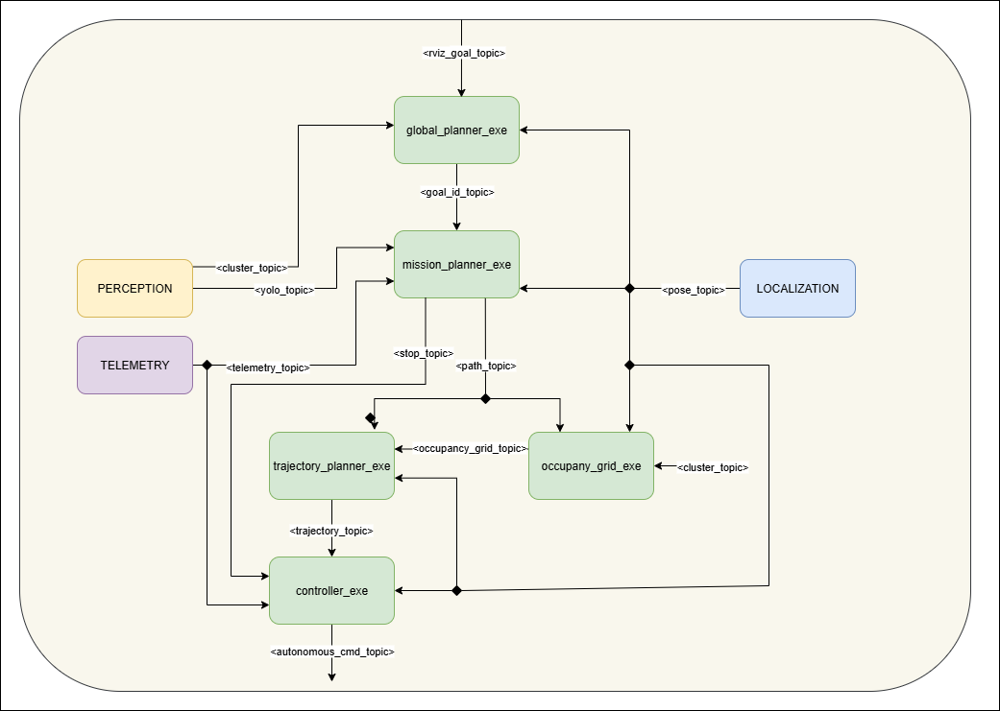

# Planner

A composable ROS 2 planning pipeline consisting of five modular nodes:

* **global\_planner**: Goal‑point selection
* **mission\_planner**: Route planning
* **occupancy\_grid**: Obstacle‑aware occupancy grid generation
* **trajectory\_planner**: Trajectory generation with different algorithms
* **controller**: Steering & speed control profile computation

---

## 📑 Modules

| Module               | Documentation                                   | Purpose                                           |
| -------------------- | ----------------------------------------------- | ------------------------------------------------- |
| `global_planner`     | [global\_planner.md][global_planner.md]         | Selects the next goal point                       |
| `mission_planner`    | [mission\_planner.md][mission_planner.md]       | Plans a complete route through lanes              |
| `occupancy_grid`     | [occupancy\_grid.md][occupancy_grid.md]         | Builds a 2D occupancy grid for obstacle avoidance |
| `trajectory_planner` | [trajectory\_planner.md][trajectory_planner.md] | Generates trajectories using the chosen algorithm |
| `controller`         | [controller.md][controller.md]                  | Computes steering angles & speed profiles         |

---

## 🚀 Quick Start

1. **Check dependencies**

   * Ensure ROS 2 (Humble or later) is installed and sourced
   * Verify `gae_msgs` and `lanelet2` are available in your workspace

2. **Build the workspace**

   ```bash
   colcon build --symlink-install --cmake-args -DCMAKE_BUILD_TYPE=Release
   source install/setup.bash   # or setup.zsh according to your terminal
   ```

3. **Launch the full system**

   ```bash
   ros2 launch planner planner_composable_launch.launch.py
   ```

---

## 🔧 Configuration

All nodes load parameters from `config.yaml`.
Refer to each module’s documentation for parameter descriptions and examples.

---

## 📦 Dependencies

* **`gae_msgs`** — message definitions (build in the same workspace or source beforehand)
* **Lanelet2** — install via:

  ```bash
  sudo apt install ros-<ros-distro>-lanelet2
  ```

[global_planner.md]: docs/global_planner.md
[mission_planner.md]: docs/mission_planner.md
[occupancy_grid.md]: docs/occupancy_grid.md
[trajectory_planner.md]: docs/trajectory_planner.md
[controller.md]: docs/controller.md

## 🗺️ Nodes & Topic Diagrams

